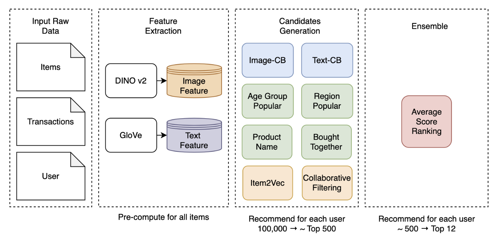

# Fashion Recommendation System
This repository contains the implmentation of a hybrid fashion recommendation system based on kaggle dataset [H&M](https://www.kaggle.com/competitions/h-and-m-personalized-fashion-recommendations/data).

**Authors**:

Haokai Zhao, Jiaqi Wang, Baoxi Liu, Ziang Zhang

**Project Report**:

The detailed report of our project and experiments is avaliable at [Report.pdf](https://github.com/JoeZhao527/fashion-rec/blob/main/Report.pdf).

    

## Main Entry
`main.ipynb` demonstrates how our recommendation system work as an integrated pipeline.

## Denpendency Installations

- Kaggle dataset download: https://www.kaggle.com/competitions/h-and-m-personalized-fashion-recommendations/data

- Dependent package download: `pip install -r requirements.txt`

- Preprocessed image and text feature download: `python scripts/download_emb.py`

## Implementation Details

- Methods implementation: `recommender/recall`

- Data filtering: `recommender/utils/data.py`

- Evaluation helper functions: `recommender/utils/evaluate.py`

- Image feature extraction: `scripts/dino_v2.py`

- Cross Validation data split: `scripts/data_split`

- Download precomputed image/text feature (from our google drive): `scripts/download_emb.py`

- Attempts to integration with larger system (incomplete): `recommender/recommender.py`

- Attempts to integrate with an flask backend (incomplete): `scripts/app.py`
